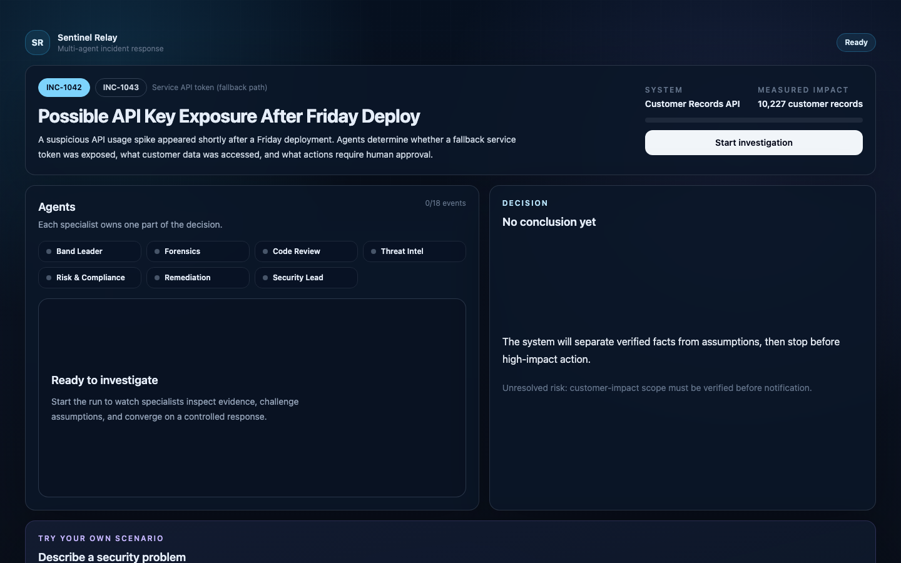

# Sentinel Relay

Sentinel Relay is a public, Band-powered multi-agent cybersecurity incident workspace. Six specialized agents investigate evidence, challenge unsupported conclusions, stop at a scoped human approval gate, coordinate remediation, and preserve an audit-ready decision trail.

## Live application

**Production:** [sentinel-relay-alpha.vercel.app](https://sentinel-relay-alpha.vercel.app)

The current interface is one focused workspace:

1. **Incident** — choose a verified evidence scenario, see impact, and start the run.
2. **Agents** — watch the active specialist’s finding and handoff.
3. **Decision / Result** — review the evolving conclusion, approve scoped containment, then inspect Summary, Evidence, and Audit tabs.

Below the seeded workflow, **Try your own scenario** accepts a short, text-only security problem and asks only the agents with a useful perspective to respond. Because this input does not include evidence files, it is routed through AI/ML API; Band powers the file- and evidence-backed workflow above.



## What is live

- Two evidence-backed scenarios: `INC-1042` and `INC-1043`.
- Six AI agent roles plus a human Security Lead.
- A real approval boundary before remediation and reporting.
- Live Band coordination when the configured remote agents respond.
- A visible `Verified replay` fallback when the live path degrades.
- Open-ended incident analysis through AI/ML API at `/api/custom-incident`.
- Signed-out production access; visitors never enter provider credentials.

## Agent team

| Participant | Responsibility |
|---|---|
| Band Leader | Frames the incident, coordinates specialists, requests approval, synthesizes the outcome |
| Forensics | Reconstructs access, authentication, and evidence timelines |
| Code Review | Finds introducing code, configuration, and deployment changes |
| Threat Intel | Assesses external behavior without overstating attribution |
| Risk & Compliance | Separates proven facts from assumptions and applies policy gates |
| Remediation | Produces containment steps constrained by approved scope |
| Human Security Lead | Approves or withholds high-impact actions |

## Execution model

Seeded investigations use `/api/agent_run`. The server attempts the configured Band workflow and streams NDJSON events to the workspace. If that integration cannot complete, the same evidence-verified transcript is replayed so the approval boundary and final result remain usable.

Open-ended questions use `/api/custom-incident`. The Band Leader frames the problem first, Forensics/Code Review/Threat Intel assess it in parallel, and Risk/Remediation react to the shared findings. This text-only path is best routed through AI/ML API because no files are supplied. Band is used for the seeded investigations, where agents coordinate around shared evidence files and preserve the collaboration trail. Both integrations keep credentials server-side.

## Run locally

Requirements: Node.js 22+, Corepack, pnpm 10, and Python 3.11+.

```bash
corepack pnpm install
corepack pnpm dev
```

Open [http://localhost:3000](http://localhost:3000). The seeded scenarios remain usable without live provider credentials through verified replay. Copy `.env.example` to `.env` or `apps/web/.env.local` to exercise Band and AI/ML API integrations.

Do not submit real incident data, secrets, production logs, or personal data to the public custom-scenario field.

## Verification

```bash
corepack pnpm verify
node scripts/dev/verify-streamlined-browser.mjs http://127.0.0.1:3000
python3 scripts/demo/verify-agent-run-api.py
```

The verification suite checks schemas, TypeScript, production build, three-panel structure, redirects, agent message counts, evidence grounding, approval sequencing, and deterministic fallbacks.

## Repository map

```text
apps/web/          Next.js workspace, server routes, and Vercel runtime
agents/            Evidence-driven Python agent implementations
data/incidents/    Synthetic evidence for INC-1042 and INC-1043
packages/schemas/  Shared TypeScript, JSON Schema, and contracts
scripts/           Verification, capture, and integration utilities
docs/              Current documentation plus labeled build-history notes
submission/        Historical event deliverables and current product screenshots
```

## Safety

All bundled incident evidence is synthetic and uses documentation-range IP addresses and redacted token labels. High-impact actions are recommendations only; Sentinel Relay does not execute destructive production changes.

See [SECURITY.md](SECURITY.md) before using the open-ended incident field.

## License

[MIT](LICENSE)
